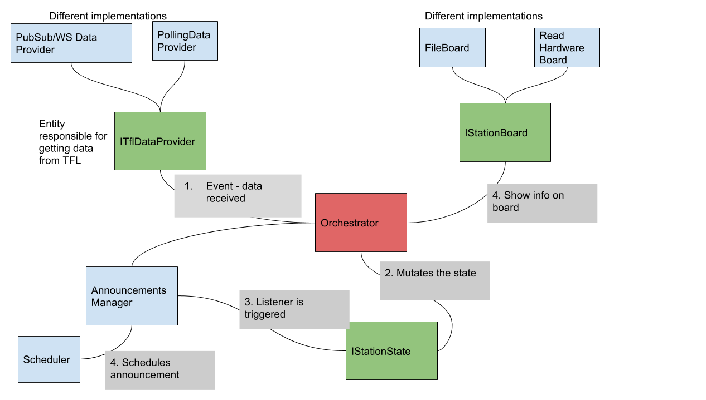

# Tfl Predictions Solution

## Entities
I decided to split the solution into responsibilities:

1. IStationBoard - the board that shows the announcements and predictions. Today it's a file, tomorrow it's a real board.
2. StationState - the current state of the station's schedule. Whenever an update is received from TFL website, we want to replace the current state with the new state, since TFL is our single source of truth.
3. AnnouncementsManager - Receives a state and triggers a scheduled announcement whenever the state is changed, while cancelling all previous scheduled announcements.
4. TFLDataProvider - our source of data. May have many implementations. If TFL one day creates a WS api - just implement the interface, pop it into the Orchestrator, and you are good to go.
5. StationOrchestrator - Orchestrates the station. Subscribes to updates from TFLProvider, updates the states when such updates occur, and sends announcements and predictions to the board when required.

You can find a visual architecture here

Or here if the the link doesnt work:
https://docs.google.com/drawings/d/1VNXUninDMiiW-yrzzhsb1yjtPG72pShhRflUAS0Qab0/edit?usp=sharing 

## Tests
There are several types of tests:
1. Unit tests
2. System Tests
3. Integration Tests.

I've started implementing tests after I created the architecture itself.

## What I would have done if I had more time
1. Before implementing the TFL client, I would have finished all tests
2. Implemented the TFL client
3. Manually tested that it all works properly
4. Created a docker container with the required runtime
5. Published reusable components in our internal nuget portal. (contracts, scheudlers, etc.)

## Issues I encountered:
1. Moq framework - I'm using it for the first time, some tests are failing because of issues with the Moq framework (or because I do not know how to use it properly). No time to dig into it now.

